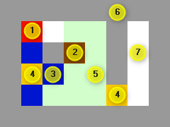

# Five lines of code book

Coding along exercise in the book 'Five Lines of Code: How and when to refactor'
by Christian Clausen (Manning, 2021).

A 2D block-pushing puzzle game similar to the classic Boulder Dash game.

## Prerequisites

- TypeScript
- Visual Studio Code
- Edge browser

## Getting started

1. Clone the project.
1. Open the root folder on VS Code
1. From the command palette - Execute: 'Tasks: Run Build Task'.
1. From the command palette - Execute: 'Debug: Start Debugging'.

## About the game

The user controls the player square using the arrow keys. The objective of the
game is to get the box (labeled 2 in figure below) to the lower-right corner.
The game elements are different colors as follows:

1. The red square is the player.
1. Brown squares are boxes.
1. Blue squares are stones.
1. Yellow squares are keys or locks.
1. Greenish squares are called flux.
1. Gray squares are walls.
1. White squares are air (empty).

## Credits

Original repository at <https://github.com/thedrlambda/five-lines>.

## License

[MIT License](./LICENSE)

Copyright &copy; 2023 Felipe Romero
